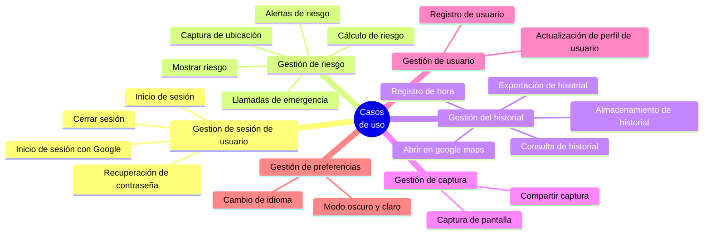
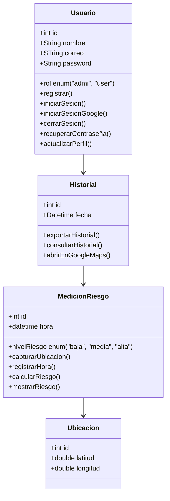
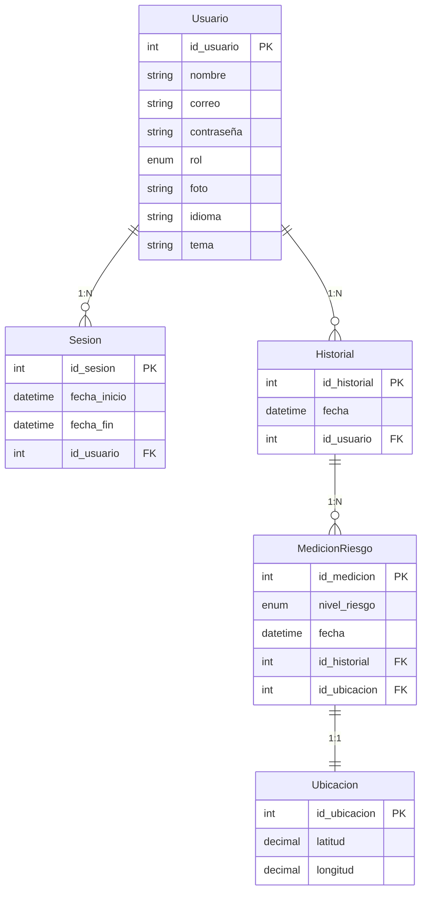
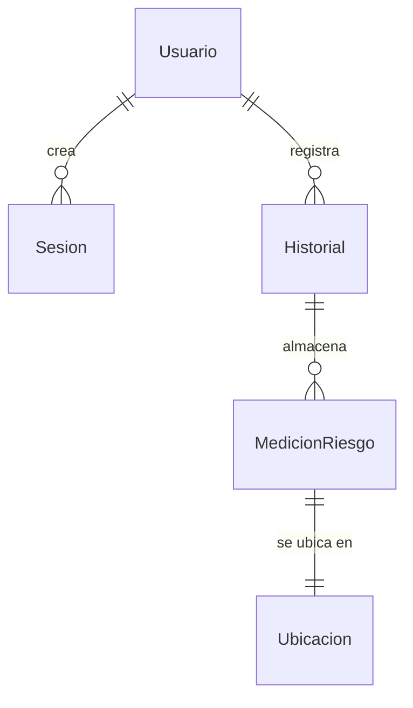

# Tabla de requerimientos funcionales

1. Registro de usuario
2. Inicio de sesión
3. Inicio de sesión con Google
4. Cerrar sesión
5. Recuperación de contraseña
6. Captura de ubicación
7. Registro de hora
8. Cálculo de riesgo
9. Mostrar riesgo
10. Captura de pantalla
11. Compartir captura
12. Almacenamiento de historial
13. Consulta de historial
14. Abrir en google maps
15. Actualización de perfil
16. Alertas de riesgo
17. Exportación de historial
18. Cambio de idioma
19. Modo oscuro y claro
20. Llamadas de emergencia

# Relacion de casos de uso

# Diagrama de clase

# Modelado de base de datos

**Modelo lógico**

**Modelo conceptual**

